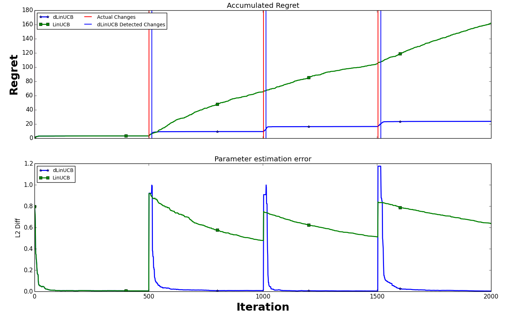

# NonstationaryBanditLib
This repo contains the implementation of a nonstationary bandit learning environment and a state-of-the-art non-stationary contextual bandit algorithm dLinUCB, which is published in SIGIR2018 [1]. (More related non-stationary algorithms will be added, stay tuned!).

##Usage
Run the simulator: `python NonStationaryEnv_Simulation.py --alg XXX` where parameter alg represents the name of algorithm. 

Run with different parameters: `python NonStationaryEnv_Simulation.py --alg XXX --tau XX --delta_1 XX --delta_2 XX` 
where 
`--tau`, `--delta_1`, `--delta_2` are the input parameters of dLinUCB

##Algorithms' details
**LinUCB**: A state-of-the-art contextual bandit algorithm. It select arms based on an upper confidence bound of the estimated reward with given context vectors. LinUCB assume that users/bandits' parameters are independent with each other. And LinUCB only works with the observed features and does not consider hidden features.

**dLinUCB**: A state-of-the-art non-stationary contextual bandit algorithm that detects possible changes of environment based on
its reward estimation confidence and updates its arm selection strategy respectively.

##Result
The following is a sample result by running 'python NonStationaryEnv_Simulation.py'

##Reference
[1]: Qingyun Wu, Naveen Iyer, and Hongning Wang. Learning Contextual Bandits in a Non-stationary Environment. The 41th International ACM SIGIR Conference on Research and Development in Information Retrieval (SIGIR'2018),  https://doi.org/10.1145/3209978.3210051

